# 支持仓颉语言服务 lsp 增量分析方案

## 背景

当前lsp调用内核的接口进行语义分析时每次都是全量处理得到带有语义的ast。

目前每次全量重新执行，耗时较久，以kei场景中的诊断功能为例，一次编译耗时xxx, 其中 parse 占x%, ConditionCompile 占x%, ImportPackage 占 x%， MacroExpand占 x%, sema 占 50%

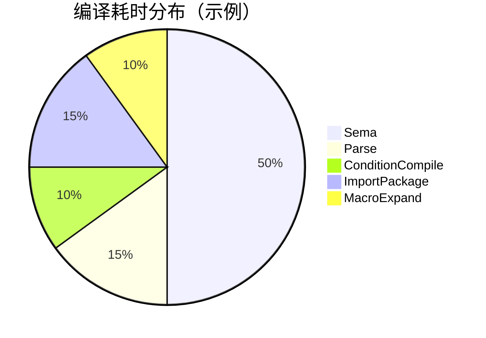

## 方案设计与分析

仓颉语言服务有非常多种业务场景，但总的可以分为代码诊断类和补全联想两类场景，前者需要执行到语义分析，后者则可以复用带有语义的ast后，再执行展开前的阶段即可

代码诊断类流程：

1. 语义分析获取带有语义的ast
Parse->ConditionCompile->ImportPackage->MacroExpand->Sema

补全联想类流程：

1. 查找缓存的带有语义的ast，若没有缓存的带有语义的ast则执行代码诊断类流程获取带有语义的ast
Parse->ConditionCompile->ImportPackage->MacroExpand->Sema

2. 获取带有语义的ast后，重新执行语法解析、条件编译、包导入获取不带语义的ast用于补全联想。
Parse->ConditionCompile->ImportPackage(可选，未修改导入语句部分不需要执行)

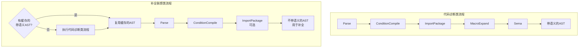

主要的分析流程中 Parse，ConditionCompile，MacroExpand 可以较自然的按照文件的维度进行增量处理，ImportPackage 可以较自然的按包进行增量处理，Sema 以文件或包级别的角度，无法决策上一次哪些分析结果可以复用，则至少需要按 Decl 维度进行分析。

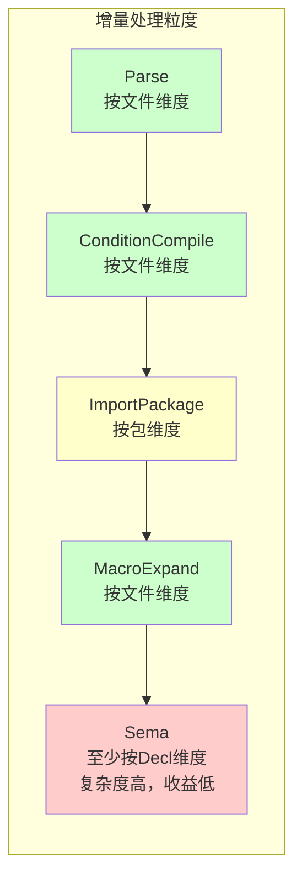

其中 Sema 以 Decl 进行分析需要更多的Decl级别的差异分析步骤，缓存处理（ast相比编译器增量还需要缓存Body用于复用、诊断的缓存和Decl的绑定，Ty类型的复用等）。该方案复杂程度高，工作量大，易出错，且易受后期Sema特性变更或bugfix的影响，给后续的开发造成额外的工作负担，更可能存在识别不到需要适配或难以适配的场景，导致增量分析的质量难以保证或者特性交付受到影响，额外引入的耗时在一些场景下可能会超出增量减少的耗时，故认为Sema 在lsp场景下的收益不高。

故本方案主要针对 Parse，ConditionCompile，ImportPackage，MacroExpand 阶段的增量进行设计，Sema 仍进行几乎全量的分析（一些解糖和typeManger已分配的类型可以尝试复用）。

### 增量编译流程

以包为编译单元。

lsp：语言服务
ci：编译器实例

1. lsp 记录当前包源码文件和上游包的变更状态。
2. ci 根据变更状态，分析需要重编的文件和导入的包
3. 根据分析结果，对缓存的ast，诊断信息，进行裁剪，去除需要重编的File和导入的包后重新执行Parse->ConditionCompile->ImportPackage->MacroExpand->Sema，将重新编译的文件和导入的上游包重新编译，得到最终的ast，诊断信息（过程中进行缓存，具体缓存方案见下文）。

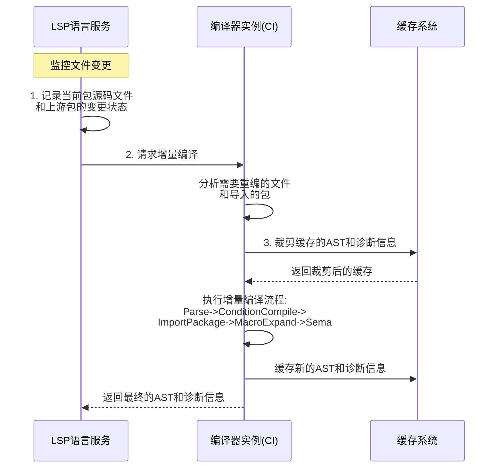

#### lsp 记录当前包源码文件和上游包的变更状态

需要缓存的信息

1.当前包各源码文件的变更状态（ChangeState）；
2.上游包的变更状态（ChangeState）：

enum ChangeState {
    NO_CHANGE, CHANGED, ADD, DELETED, ...
}

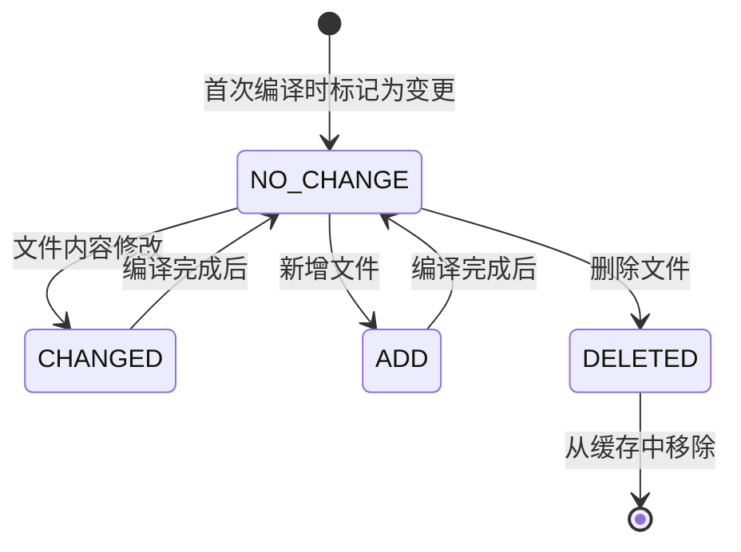

**注意：**

> 第一次编译时，都要标记成变更状态。

##### 当前包源码的状态和缓存

- 记录文件的相对于上一次分析的变更状态

##### 上游包的状态

###### cjo的状态

- std依赖的cjo缓存在lsp生命周期内不变（发生改变需要重启lsp）
- bin依赖的cjo缓存在lsp生命周期内不变（发生改变需要重启lsp）
- 源码依赖，在上游包发生修改时，cjo也发生改变时需要刷新变更状态。

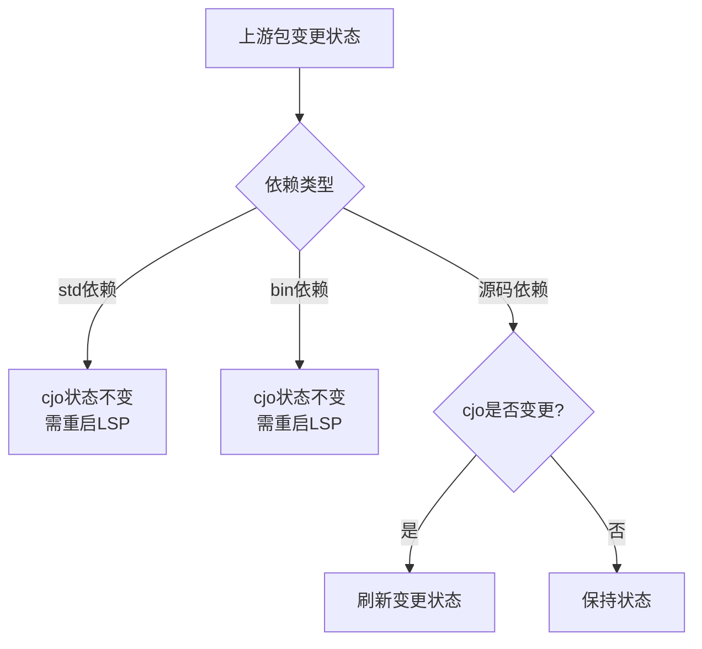

###### 源码的状态

- 特别的，对于源码依赖的宏包，一些场景修改宏的实现不会导致cjo变化，但是会导致so发生变化进而会影响展开结果，在正常场景下用户点击构建按钮，lsp会重启，不会影响增量编译结果，但用户若是在命令行中重编，不会触发lsp重启，但可能会刷新宏展开结果，故还需要额外记录宏包的源码变更状态。

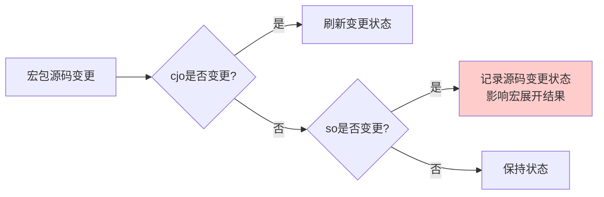

### 重编范围分析方案

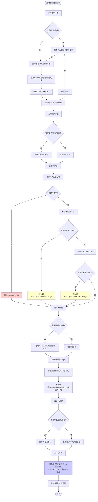

详细步骤说明：

- 若存在文件变更/删除，则在缓存的ast中删除对应的File节点，对于没发生文件变更的，计算每个File节点导入的宏包，若存在导入的宏包发生了变更，当作文件变更处理。重新 Parse 变更/删除/新增的文件，将其替换/添加到缓存的ast中，没有重新解析的File节点将缓存中对应的报错重新报出。
- 对于存在变更/删除/新增的文件重新执行条件编译，其他文件跳过条件编译处理。
- 根据上一次编译记录的包的依赖关系（当前包以及所有依赖包的下游包和上游包信息）和lsp记录的上游包cjo的变更状态，将变更的包记为 NeedReload 其下游包/上游包标记为 NeedUpdateDueUpChange/NeedUpdateDueDownChange（下游包可能存在引用上游包的情况需要刷新，需要重新计算Ty和target, 上游包类型中记录了些直接子类的引用信息）。

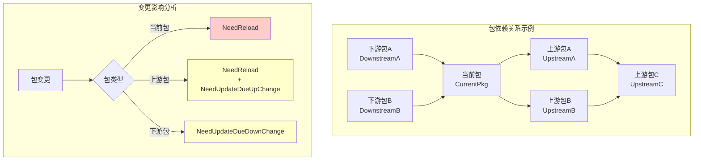

- 执行包导入流程. (1) 在处理导包语句时（对于不需要重新加载的包直接复用原来importedPackages的ast）(2) 处理完导包语句，将所有依赖预导入后，对typeManger进行更新，将需要重编的文件,重新导入的包和本次没有导入包中的Ty删除，对新增或者标记NeedReload/NeedUpdateDueUpChange/NeedUpdateDueDownChange，刷新引用。
- 执行宏展开流程，对于存在编/删除/新增的文件重新执行宏展开，没有重新展开的File节点将缓存中对应的报错重新报出。
- 对于复用了File节点的ast 擦除Ty，target，CHECK_VISITED 等Sema信息，重新执行Sema流程（需新增一些重入处理）。

### ast/ty等缓存方案

分析结果的缓存：

每次分析的结果直接缓存在内存中，和CompilerInstance的生命周期一致。

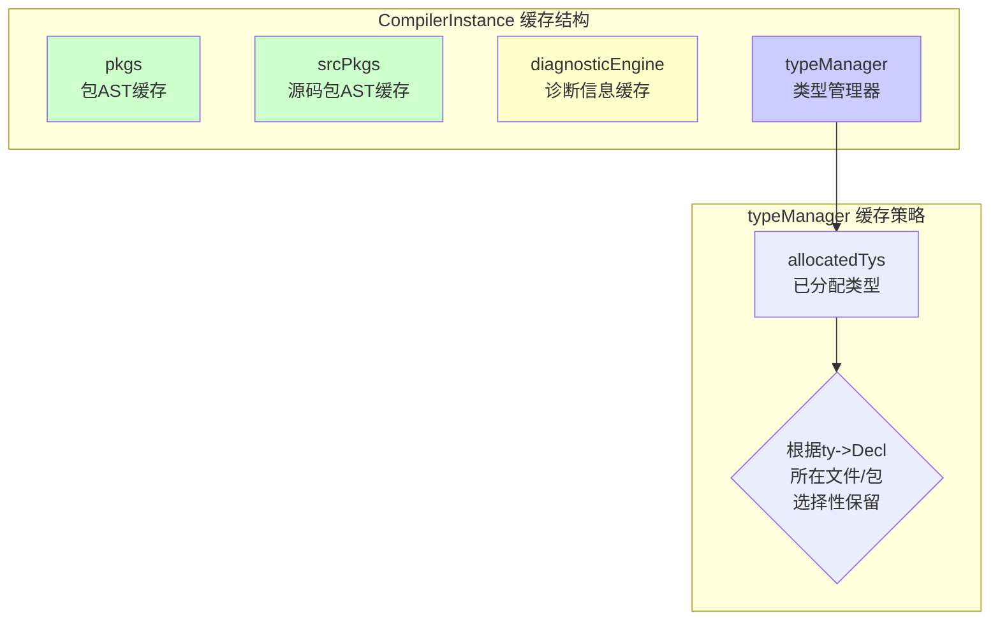

#### 补全场景

对于补全场景，直接利用上一次的CompilerInstance 中的 pkgs，srcPkgs 以及 diagnosticEngine 中的缓存（需新增 cache）

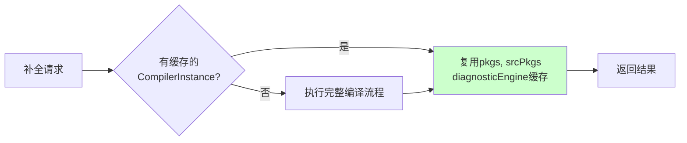

#### 诊断场景

对于诊断分析类场景，需要缓存Sema前的ast。

- 方案1 对于Sema后的ast进行Sema信息擦除（Ty，target，CHECK_VISITED，解糖？等）
- 方案2 对于Sema前的ast进行clone
（pkgs 和 srcPkgs（是拷贝sema前的ast还是擦除Sema的信息，类型，解糖，CHECK_VISITED等信息）。

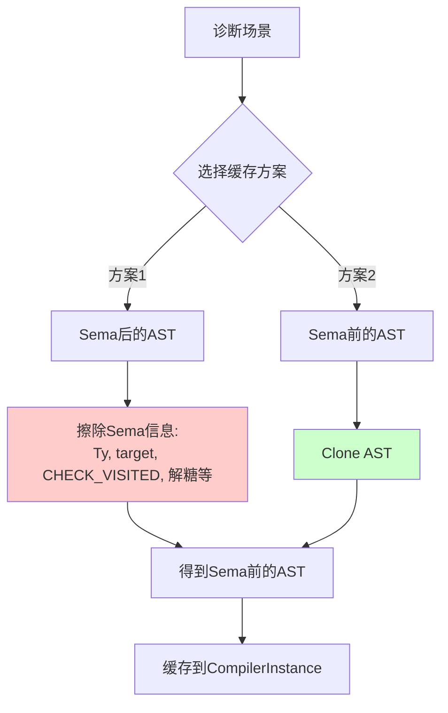

#### 相同部分

typeManger（allocatedTys中根据ty->Decl所在文件/包选择性保留）

## 方案实现交付策略

渐进式：

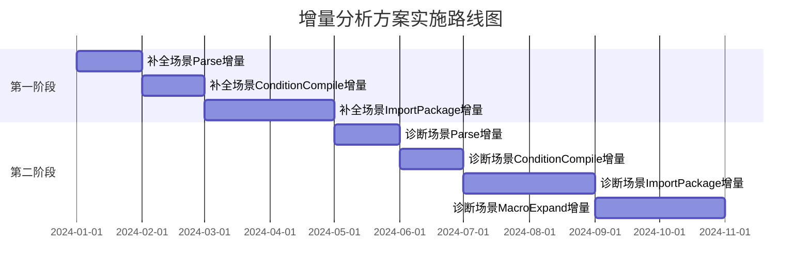

详细实施计划：

1. 先对补全场景获取不带语义 ast 流程中的Parse->ConditionCompile->ImportPackage 增量分析进行支持
2. 后支持诊断场景的 Parse->ConditionCompile->ImportPackage->MacroExpand 阶段的增量
